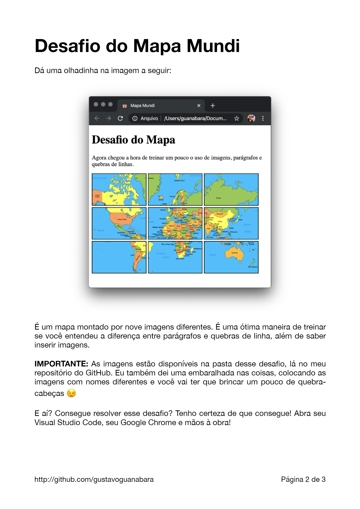

## Desafio03HTML

Link do meu projeto
https://jefersonbarros.github.io/Desafio-Do-Mapa/

Esse é a resolução do terceiro desafio do curso: Módulo 1 HTML e CSS do curso em vídeo. Link dos Desafios (Repositório do Gustavo Guanabara): https://github.com/gustavoguanabara/html-css/tree/master/desafios Desafio 03: https://github.com/gustavoguanabara/html-css/blob/master/desafios/modulo-01/d003/desafio-mapa-mundi.pdf

